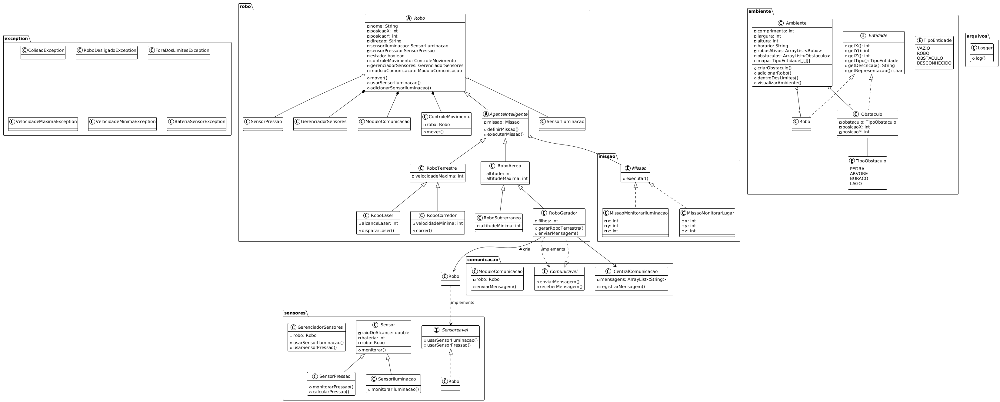

# Projetos e Entregas – MC322  

Este repositório contém as entregas da disciplina **MC322**, documentando o desenvolvimento dos projetos e registrando as implementações realizadas ao longo dos cinco laboratórios.  

---

## Lab01 - Robôs e Ambiente  

Implementação inicial de um Simulador de Robôs, composta por três arquivos principais:  

- **Robo.java** – Define a classe `Robo`, suas propriedades e métodos.  
- **Ambiente.java** – Implementa a classe `Ambiente`, responsável por suas características e comportamentos.  
- **Main.java** – Classe principal que cria e manipula os objetos conforme as regras do enunciado.  

---

## Lab02 - Simulação Avançada de Robôs  

Expansão do simulador de robôs, com novos tipos e funcionalidades avançadas.  

### Arquivos principais:  
- **Robo.java** – Classe base para todos os robôs, com métodos de movimentação e detecção de obstáculos.  
- **RoboTerrestre.java** – Especialização de `Robo` para robôs terrestres, com restrições de velocidade máxima.  
- **RoboAereo.java** – Especialização de `Robo` para robôs aéreos, com controle de altitude.  
- **RoboSubterraneo.java** – Especialização de `RoboAereo` para robôs subterrâneos, com altitude mínima.  
- **RoboLaser.java** – Especialização de `RoboTerrestre` com capacidade de disparar lasers.  
- **RoboGerador.java** – Robô que cria outros robôs no ambiente.  
- **RoboCorredor.java** – Especialização de `RoboTerrestre` com restrições de velocidade mínima e máxima.  
- **Ambiente.java** – Define o ambiente tridimensional e gerencia os robôs ativos.  
- **Main.java** – Executa a simulação, criando robôs, movimentando-os e verificando interações.  

---

## Lab03 - Simulador de Robôs com Sensores e Obstáculos  

Aprimoramento do simulador com sensores e obstáculos, introduzindo novos relacionamentos entre classes.  

### Arquivos principais:  
- **Ambiente.java** – Atualizado para gerenciar obstáculos e robôs com `ArrayList`.  
- **Obstaculo.java** – Representa obstáculos com tipo enumerado.  
- **TipoObstaculo.java** – Enum que define tipos de obstáculos (PEDRA, ARVORE, BURACO, LAGO).  
- **Sensor.java** – Classe base para sensores.  
- **SensorIluminacao.java** – Sensor para monitorar iluminação.  
- **SensorPressao.java** – Sensor para monitorar pressão.  
- **Main.java** – Atualizado com menu interativo para controle dos robôs.  
- **Robo.java** – Classe base para todos os robôs.  
- **RoboTerrestre.java** – Especialização de `Robo` para robôs terrestres.  
- **RoboAereo.java** – Especialização de `Robo` para robôs aéreos.  
- **RoboSubterraneo.java** – Especialização de `RoboAereo` para robôs subterrâneos.  
- **RoboLaser.java** – Robô terrestre com capacidade de disparar lasers.  
- **RoboGerador.java** – Robô que cria outros robôs no ambiente.  
- **RoboCorredor.java** – Robô terrestre com restrições de velocidade mínima e máxima.  

### Funcionalidades Implementadas:  
1. **Obstáculos no Ambiente**:  
   - Diferentes tipos de obstáculos com propriedades específicas.  
   - Verificação de colisões.  
   - Métodos para adicionar/remover obstáculos.  

2. **Sensores**:  
   - Sistema de sensores agregados aos robôs.  
   - Sensores de Iluminação e Pressão.  
   - Métodos para monitorar o ambiente.  

3. **Menu Interativo**:  
   - Visualização do status de robôs e ambiente.  
   - Controle de movimentos básicos.  
   - Relatórios dos sensores.  
   - Criação e destruição de robôs e obstáculos.  

4. **Melhorias nas Classes Existentes**:  
   - Robôs atualizados para considerar obstáculos.  
   - Ambiente com métodos para verificação de limites.  
   - Relacionamentos entre classes implementados (agregação, composição).  

---

## Lab04 - Simulador Avançado de Robôs com Comunicação e Geração  

Aprimoramento do simulador de robôs com funcionalidades avançadas de comunicação entre robôs, geração de novos robôs e tratamento de exceções personalizadas.  

### Arquivos principais:  
- **Ambiente.java** – Gerencia o ambiente 3D, os robôs, obstáculos e o mapa.  
- **CentralComunicacao.java** – Central que gerencia o histórico de mensagens entre os robôs.  
- **Main.java** – Classe principal com menu interativo e controle do simulador.  
- **Obstaculo.java** – Representa obstáculos no ambiente.  
- **Robo.java** – Classe base para todos os robôs, com movimentos básicos e sensores.  
- **RoboAereo.java** – Robô aéreo com controle de altitude.  
- **RoboCorredor.java** – Robô corredor com limites de velocidade mínima e máxima.  
- **RoboGerador.java** – Robô gerador que cria outros robôs e se comunica.  
- **RoboLaser.java** – Robô com capacidade de disparar laser.  
- **RoboSubterraneo.java** – Robô subterrâneo com profundidade mínima.  
- **RoboTerrestre.java** – Robô terrestre com limite de velocidade.  
- **Sensor.java** – Classe base para sensores.  
- **SensorIluminacao.java** – Sensor específico para monitorar iluminação.  
- **SensorPressao.java** – Sensor específico para monitorar pressão.  

### Interfaces:  
- **Comunicavel.java** – Define métodos para comunicação entre robôs.  
- **Corredor.java** – Define comportamento para robôs corredores.  
- **Entidade.java** – Interface comum para todas as entidades no ambiente.  
- **Gerador.java** – Define métodos para gerar diferentes tipos de robôs.  
- **Laser.java** – Define comportamento para robôs com laser.  
- **Sensoreavel.java** – Define métodos para uso de sensores.  

### Exceções Personalizadas:  
- **BateriaSensorException.java** – Bateria do sensor esgotada.  
- **ColisaoException.java** – Detecção de colisão iminente.  
- **ErroComunicacaoException.java** – Falha na comunicação entre robôs.  
- **ForaDosLimitesException.java** – Movimento além dos limites do ambiente.  
- **RoboDesligadoException.java** – Operação tentada com robô desligado.  
- **VelocidadeMinimaException.java** – Velocidade abaixo do mínimo para robô corredor.  

### Enums:  
- **TipoEntidade.java** – Tipos de entidades no ambiente (`ROBO`, `OBSTACULO`, etc.).  
- **TipoObstaculo.java** – Tipos de obstáculos (`PEDRA`, `ARVORE`, `BURACO`, etc.).  

### Funcionalidades do Menu 
1. **Menu Principal**:  
   - Listar todos os robôs  
   - Listar robôs por tipo (terrestres, aéreos, etc.)  
   - Listar robôs por estado (ligados/desligados)  
   - Selecionar robô para controle detalhado  
   - Visualizar mapa do ambiente  
   - Listar mensagens de comunicação  
   - Sair do sistema  

2. **Menu do Robô Selecionado**:  
   - Visualizar status completo  
   - Executar tarefa principal (gerar robôs, disparar laser, correr)  
   - Controlar movimento (frente, trás, direita, esquerda, subir, descer)  
   - Comunicar com outro robô  
   - Acionar sensores  
   - Ligar/Desligar robô  
   - Voltar ao menu principal  

---

## Lab05 - Simulador de Robôs com Missões e Componentes Modulares

Aprimoramento do simulador com sistema de missões, componentes modulares e agentes inteligentes.

### Novos Arquivos:
- **AgenteInteligente.java** - Classe abstrata para robôs com capacidade de executar missões
- **Missao.java** - Interface para definição de missões
- **MissaoMonitorarIluminacao.java** - Missão para monitorar níveis de iluminação
- **MissaoMonitorarLugar.java** - Missão para investigar locais específicos
- **ModuloComunicacao.java** - Componente para gerenciar comunicação entre robôs
- **GerenciadorSensores.java** - Componente para gerenciar operações com sensores
- **ControleMovimento.java** - Componente para gerenciar movimentos dos robôs
- **Logger.java** - Sistema de registro de eventos e ações

### Atualizações Significativas:
1. **Sistema de Missões**:
   - Robôs podem receber e executar missões específicas
   - Missões de monitoramento ambiental e investigação
   - Agentes inteligentes especializados em execução de missões

2. **Arquitetura Modular**:
   - ControleMovimento: encapsula toda lógica de movimento
   - GerenciadorSensores: gerencia operações com sensores
   - ModuloComunicacao: trata comunicação entre robôs
   - Logger: registra todas as ações importantes no sistema

3. **Novas Funcionalidades no Menu**:
   - Definir missões para robôs específicos
   - Executar missões atribuídas
   - Visualizar histórico de ações (log)
   - Controle mais granular dos componentes

4. **Melhorias Gerais**:
   - Tratamento refinado de exceções
   - Sistema de colisões aprimorado
   - Visualização 3D do ambiente
   - Geração de relatórios de missões

### Diagrama de Classes Atualizado:


---

## Estrutura Completa do Projeto  

```plaintext
MC322/
├── src/
│   ├── Lab01/
│   │   ├── Ambiente.java
│   │   ├── Main.java
│   │   └── Robo.java
│   ├── Lab02/
│   │   ├── Ambiente.java
│   │   ├── Main.java
│   │   ├── Robo.java
│   │   ├── RoboAereo.java
│   │   ├── RoboCorredor.java
│   │   ├── RoboGerador.java
│   │   ├── RoboLaser.java
│   │   ├── RoboSubterraneo.java
│   │   ├── RoboTerrestre.java
│   │   └── (outros arquivos do lab02)
│   ├── Lab03/
│   │   ├── Ambiente.java
│   │   ├── Main.java
│   │   ├── Obstaculo.java
│   │   ├── Robo.java
│   │   ├── RoboAereo.java
│   │   ├── RoboCorredor.java
│   │   ├── RoboGerador.java
│   │   ├── RoboLaser.java
│   │   ├── RoboSubterraneo.java
│   │   ├── RoboTerrestre.java
│   │   ├── Sensor.java
│   │   ├── SensorIluminacao.java
│   │   ├── SensorPressao.java
│   │   ├── TipoObstaculo.java
│   │   └── (outros arquivos do lab03)
│   ├── Lab04/
│   │   ├── Ambiente.java
│   │   ├── BateriaSensorException.java
│   │   ├── CentralComunicacao.java
│   │   ├── ColisaoException.java
│   │   ├── Comunicavel.java
│   │   ├── Corredor.java
│   │   ├── Entidade.java
│   │   ├── ErroComunicacaoException.java
│   │   ├── ForaDosLimitesException.java
│   │   ├── Gerador.java
│   │   ├── Laser.java
│   │   ├── Main.java
│   │   ├── Obstaculo.java
│   │   ├── Robo.java
│   │   ├── RoboAereo.java
│   │   ├── RoboCorredor.java
│   │   ├── RoboGerador.java
│   │   ├── RoboLaser.java
│   │   ├── RoboSubterraneo.java
│   │   ├── RoboTerrestre.java
│   │   ├── Sensor.java
│   │   ├── SensorIluminacao.java
│   │   ├── SensorPressao.java
│   │   ├── Sensoreavel.java
│   │   ├── TipoEntidade.java
│   │   ├── TipoObstaculo.java
│   │   ├── VelocidadeMinimaException.java
│   │   └── RoboDesligadoException.java
│   └── Lab05/
│       ├── ambiente/
│       │   └── Ambiente.java
│       ├── arquivos/
│       │   └── Logger.java
│       ├── comunicacao/
│       │   ├── CentralComunicacao.java
│       │   ├── Comunicavel.java
│       │   └── ModuloComunicacao.java
│       ├── exception/
│       │   ├── BateriaSensorException.java
│       │   ├── ColisaoException.java
│       │   ├── ErroComunicacaoException.java
│       │   ├── ForaDosLimitesException.java
│       │   ├── RoboDesligadoException.java
│       │   └── VelocidadeMinimaException.java
│       ├── main/
│       │   └── Main.java
│       ├── missao/
│       │   ├── Missao.java
│       │   ├── MissaoMonitorarIluminacao.java
│       │   └── MissaoMonitorarLugar.java
│       ├── robo/
│       │   ├── AgenteInteligente.java
│       │   ├── ControleMovimento.java
│       │   ├── Corredor.java
│       │   ├── Gerador.java
│       │   ├── Laser.java
│       │   ├── Robo.java
│       │   ├── RoboAereo.java
│       │   ├── RoboCorredor.java
│       │   ├── RoboGerador.java
│       │   ├── RoboLaser.java
│       │   ├── RoboSubterraneo.java
│       │   ├── RoboTerrestre.java
│       │   └── Sensoreavel.java
│       ├── sensores/
│       │   ├── GerenciadorSensores.java
│       │   ├── Sensor.java
│       │   ├── SensorIluminacao.java
│       │   └── SensorPressao.java
│       └── (outros arquivos do Lab05)
├── bin/
├── diagrama_uml.png
└── README.md

## Como Executar 

1. Chegue até a pasta
   ```bash
   cd src/LabXX
   ```

2. Compile:  
   ```bash
   javac *.java
   ```

3. Execute:  
   ```bash
   java Main
   ```